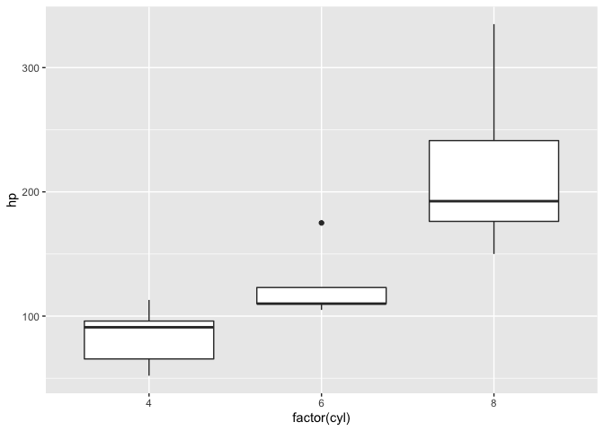
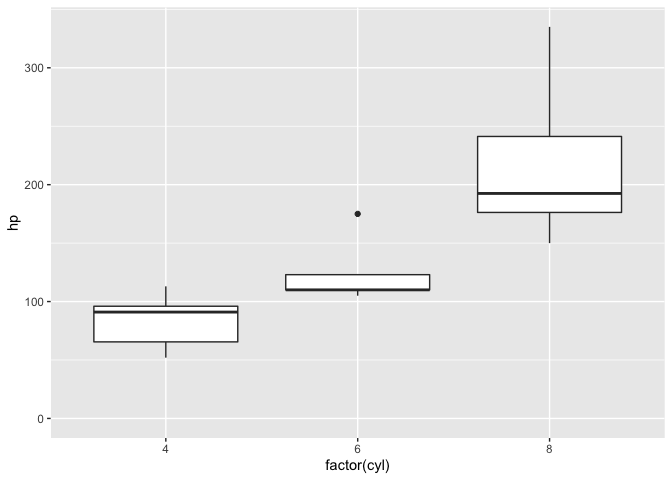

# How to only change the lower or upper axis limit of a ggplot

By default `ggplot2` automatically chooses the lower and upper bound for
each axis based on the minimum and maximum value in your data. Have a
look at this example:

``` r
library(ggplot2)
data(mtcars)

ggplot(mtcars, aes(factor(cyl), hp)) + 
  geom_boxplot()
```

<!-- -->

If the variable you want to plot has a ‘natural’ zero, e.g. height or
weight, it is best practice to have the lower axis limit be 0. This can
be archieved like this:

``` r
ggplot(mtcars, aes(factor(cyl), hp)) + 
  geom_boxplot() +
  ylim(0, NA)
```

<!-- -->

Notice the `NA` as the second argument to `ylim()`. This will let
`ggplot2` pick the ‘best’ upper axis without you having to take care of
it.
