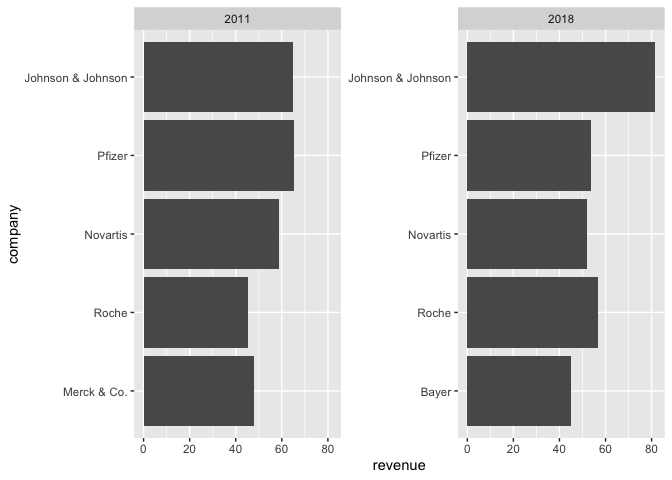
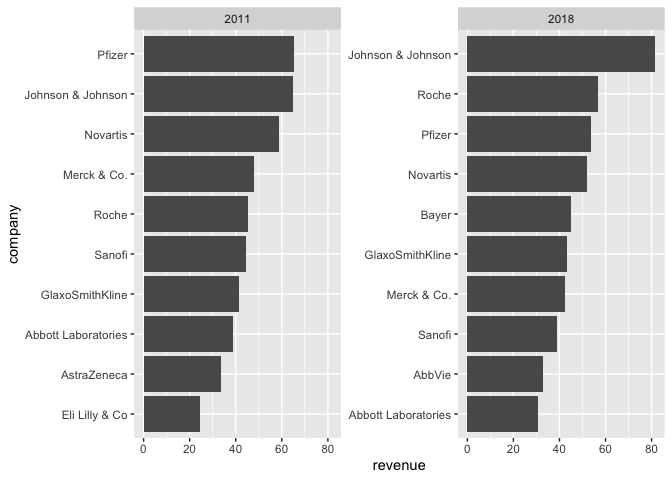
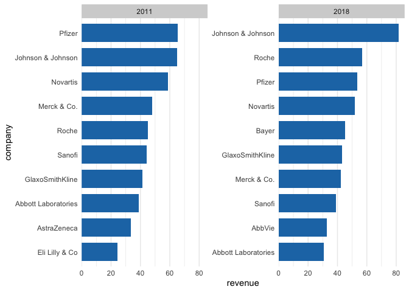

# How to create an ordered bar chart with facets using ggplot2?

``` r
library(ggplot2)
library(ggcharts)
library(dplyr)
data("biomedicalrevenue")

data <- biomedicalrevenue %>%
  filter(year %in% c(2011, 2018))
```

First, let’s try the ‘usual’ way of creating an ordered bar chart:
ordering the data by the y variable and subsequently converting the x
variable to a factor using `reorder()`.

``` r
data %>%
  top_n(10, revenue) %>%
  mutate(
    year = factor(year),
    company = reorder(company, revenue)
  ) %>%
  ggplot(aes(company, revenue)) +
  geom_col() +
  coord_flip() +
  facet_wrap(~year, scales = "free_y")
```

<!-- -->

Hmm. That doesn’t look exactly how we wanted it to be. Instead have a
look at the following code.

``` r
data %>%
  group_by(year) %>%
  top_n(10, revenue) %>%
  ungroup() %>%
  mutate(
    year = factor(year),
    company = tidytext::reorder_within(company, revenue, year)
  ) %>%
  ggplot(aes(company, revenue)) +
  geom_col() +
  coord_flip() +
  facet_wrap(~year, scales = "free_y") +
  tidytext::scale_x_reordered()
```

<!-- -->

Much better\! There are three key things you need to do to create an
ordered bar chart with facets. First, notice the
`tidytext::reorder_within()` function. Next, pay attention to `scales =
"free_y"` inside of `facet_wrap()`. Finally, you will need to call
`tidytext::scale_x_reordered()` to finish off.

But that’s hard\! Just look at the code: It took more than 10 steps to
create the plot. There must be an easier way to do this. Fortunately
enough there is\!

The `bar_chart()` function from `ggcharts` does all of the above for you
when you pass a variable to its `facet` argument.

``` r
bar_chart(data, company, revenue, facet = year, limit = 10)
```

<!-- -->

That’s it\! In one line of code you get what you want. That’s the aim of
`ggcharts`: shortening the way from a data visualization idea to an
actual plot as much as possible. To learn more about `ggcharts` check
out its [GitHub
Repository](https://github.com/thomas-neitmann/ggcharts).
