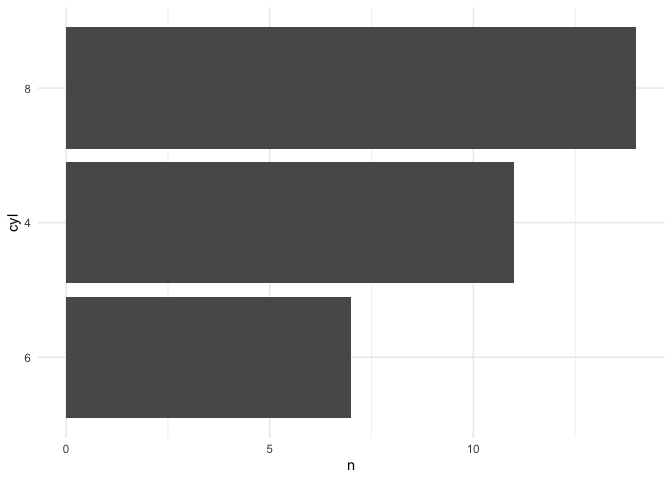
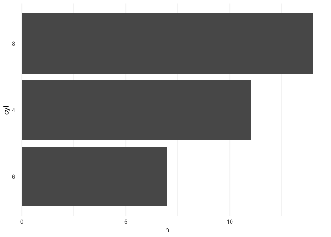
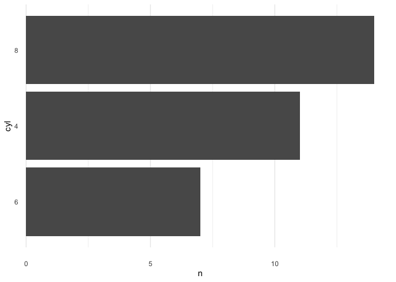
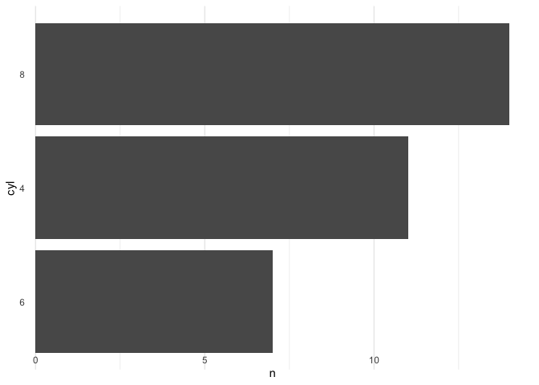

How to get move ticks closer to the axis?
=========================================

To answer this question let’s start off by loading some packages and
preparing userRs favorite dataset `mtcars` for plotting.

    library(dplyr)
    library(ggplot2)
    data("mtcars")

    cyl <- count(mtcars, cyl) %>%
      arrange(n) %>%
      mutate(cyl = reorder(cyl, n))

    cyl

    ## # A tibble: 3 x 2
    ##   cyl       n
    ##   <fct> <int>
    ## 1 6         7
    ## 2 4        11
    ## 3 8        14

Next, let’s create a basic plot.

    p1 <- ggplot(cyl, aes(cyl, n)) +
      geom_col() +
      theme_minimal() +
      coord_flip()
    p1

That’s already quite nice but for a bar chart the horizontal grid lines
are redundant. Let’s remove them.

    p2 <- p1 + theme(
      panel.grid.major.y = element_blank(),
      panel.grid.minor.y = element_blank()
    )
    p2

Great! But now the axis ticks are quite far from the bars. Let’s move
them closer.

    p3 <- p2 + theme(axis.text.y = element_text(margin = margin(r = -15)))
    p3

And there you have it! That’s how you move axis ticks closer to the
axis. The `r` argument within `margin()` stands for right. Accordingly,
there are also `l`, `t` and `b` for left, top and bottom, respectively.

Next, let’s try to move the x axis ticks up. Notice the `axis.text.x`
instead of `axis.text.y`.

    p3 + theme(axis.text.x = element_text(margin = margin(t = 15)))

Huh, that was unexpected: the ticks went down instead of up. Let’s try
passing a negative number.

    p3 + theme(axis.text.x = element_text(margin = margin(t = -15)))

That did the job! It’s probably a bit too high but you get the idea.
